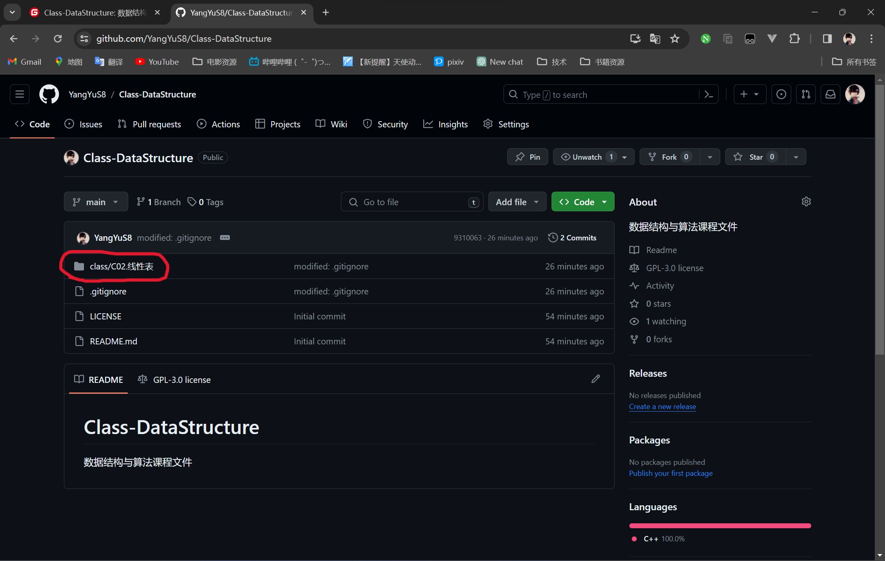
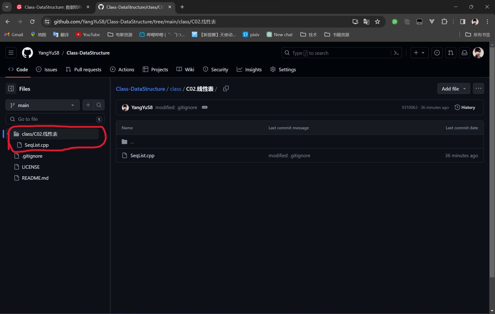
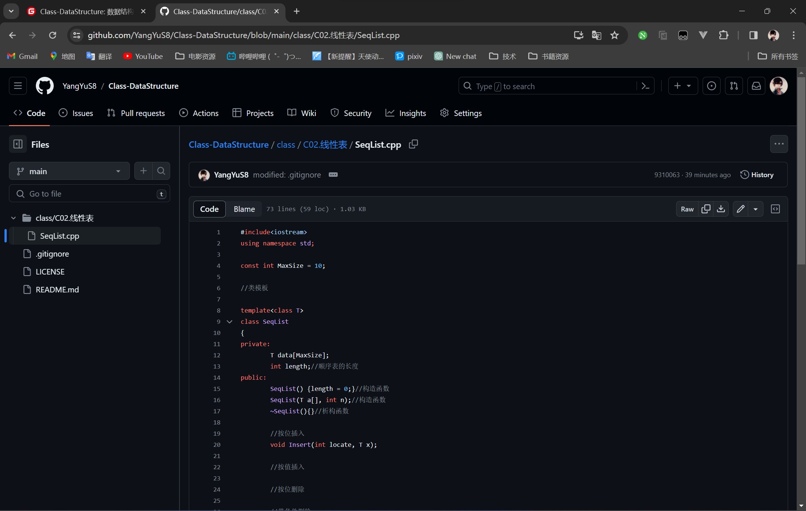

# 数据结构与算法课程文件

[](http://hits.dwyl.com/YangYuS8/Class-DataStructure)    

@import "[TOC]" {cmd="toc" depthFrom=1 depthTo=6 orderedList=false}

<!-- code_chunk_output -->

- [数据结构与算法课程文件](#数据结构与算法课程文件)
  - [简介](#简介)
  - [使用方法](#使用方法)
    - [一、直接在Github或Gitee页面查看](#一-直接在github或gitee页面查看)
    - [二、文件夹的目录解释](#二-文件夹的目录解释)
  - [最后](#最后)

<!-- /code_chunk_output -->

## 简介

> ​	这个仓库用来存放我学习数据结构时写的代码文件，包括课上的案例和课后练习，我会尽可能与老师保持同样的节奏，同学们如果有上课没听懂或者没注意的地方可以参考一下这里的代码。如果对你有所帮助，不妨点个Star支持一下？

## 使用方法

### 一、直接在Github或Gitee页面查看

**1.打开Github(或Gitee)访问链接：**

- Github(需要开梯子)：[YangYuS8/Class-DataStructure](https://github.com/YangYuS8/Class-DataStructure)
- Gitee(国内可直连)：[杨与S8/Class-DataStructure](https://gitee.com/YangYuS8/Class-DataStructure)

**2.打开class文件夹：(以GitHub演示)**



**3.查看文件列表，选择文件：**



**4.打开文件即可查看源代码：**



### 二、文件夹的目录解释

> 最开始是想直接用中文文件夹作为目录的，但是后来发现Windows平台上的VSCode编译器中C++的开发不兼容中文路径，遂决定更改为英文目录并在此页面附加中文介绍

```powershell
Class-DataStructure
│  .gitignore	// git仓库排除列表
│  LICENSE		// 开源证书
│  README.md	// 本仓库的说明文件
│
├─assets		// 主要存放文章配图
│  └─img		// 图片目录
│
├─class			// 课堂上写的程序源代码
│  ├─C02.LinearList		// 线性表
│  │
│  ├─C03.Tree			// 树
│  │
│  ├─C04.Graph			// 图
│  │
│  └─C05.Search			// 查找
│  │
│  └─C06.Sort			// 排序
│
└─practice		// OJ练习题的源代码
```

## 最后

> ​	本仓库旨在为各位同学复习时提供一定帮助，希望同学们能在有一定的思考后借鉴，另外，欢迎各位将链接分享给他人！如果觉得有帮助不妨点个Star支持一下？
